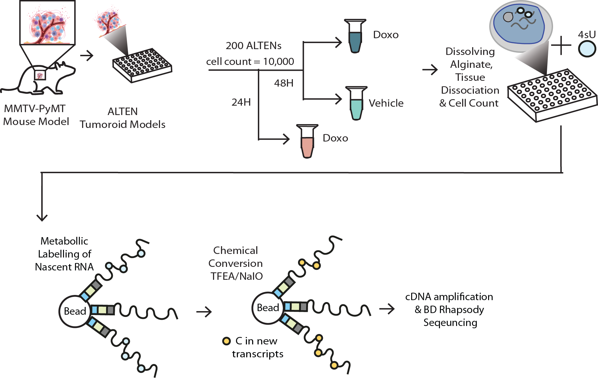

.. _mmtv_pymt_alten_model:

MMTV-PyMT ALTEN Model
======================

This section describes the biological model system used to demonstrate scBaNdicooT and provides details of the experimental design.

Background
----------

Understanding how individual tumour cells respond to chemotherapy in real time is one of the biggest challenges in cancer biology. Traditional bulk and single-cell RNA-seq provide snapshots of total gene expression but struggle to distinguish **newly activated transcriptional programs** from long-lived, pre-existing RNA. This makes it difficult to capture the earliest molecular events that determine whether a cell will become sensitive, resistant, or committed to cell death.

scBaNdicooT addresses this by combining **metabolic RNA labelling** with single-cell sequencing, enabling a time-resolved view of transcriptional activity at single-cell resolution.

The MMTV-PyMT Mouse Model
--------------------------

The **MMTV-PyMT** (Mouse Mammary Tumour Virus — Polyoma Middle T Antigen) transgenic mouse model is a well-established, genetically engineered model of luminal breast cancer. Key features:

* PyMT oncogene expression is driven by the MMTV promoter, leading to spontaneous mammary tumour development in female mice.
* Tumours are histologically and transcriptionally similar to human luminal B breast cancer.
* The model recapitulates tumour heterogeneity, including epithelial, immune, endothelial, and stromal cell populations.
* Tumours develop rapidly and are amenable to ex vivo culture.

The ALTEN System
----------------

To preserve the **native 3D tumour architecture** and microenvironment during culture and drug treatment, we use the **ALTEN** (Alginate-based Tissue Engineering) system:

* Freshly dissected MMTV-PyMT mammary tumour fragments are dissociated and re-encapsulated in alginate hydrogel beads.
* Alginate encapsulation maintains cell–cell contacts and ECM interactions that are lost in standard 2D or dissociated 3D cultures.
* Tumoroids are viable for multiple days in culture, enabling controlled drug treatment experiments.
* The 3D architecture supports the survival of rare stromal and immune populations that are often lost in standard organoid protocols.

Experimental Design
-------------------

To profile transcriptional responses to chemotherapy, ALTEN tumoroids were treated with **Doxorubicin** (a first-line anthracycline chemotherapy agent) and metabolically labelled with **4-thiouridine (4sU)**:

.. list-table::
   :widths: 30 70
   :header-rows: 1

   * - Parameter
     - Value
   * - **Model**
     - MMTV-PyMT mammary tumour tumoroids (ALTEN system)
   * - **Treatment**
     - Doxorubicin (500 nM, 24 h) or vehicle control
   * - **Metabolic label**
     - 4-thiouridine (4sU), 2-hour pulse prior to harvest
   * - **Single-cell platform**
     - BD Rhapsody (microwell-based)
   * - **Sequencing**
     - Paired-end, Illumina NovaSeq
   * - **Target cells**
     - ~5,000 cells per sample

4sU Labelling Protocol
----------------------

Nascent RNA labelling was performed as follows:

1. ALTEN tumoroids were cultured for 24 hours in the presence or absence of Doxorubicin.
2. During the final 2 hours of treatment, **4sU** (500 µM) was added to the culture medium.
3. Tumoroids were harvested, dissociated to single cells, and processed immediately for BD Rhapsody capture.
4. T-to-C conversion of 4sU-labelled uridines occurs during SLAM-seq library preparation, enabling downstream computational identification of newly synthesised transcripts.

Cell Populations Profiled
--------------------------

scBaNdicooT identified the following major cell populations in the MMTV-PyMT ALTEN tumoroids:

* **Epithelial cells** (tumour cells): Luminal and basal subtypes; primary drug response population.
* **Cancer-associated fibroblasts (CAFs)**: Stromal cells with diverse activation states.
* **Macrophages and myeloid cells**: Tumour-associated immune populations.
* **Endothelial cells**: Vascular component preserved by the ALTEN system.
* **T cells**: Rare immune infiltrate.

Key Findings
------------

* scBaNdicooT identified transcriptional responses to Doxorubicin **within 2 hours**, well before changes are visible in steady-state RNA.
* **Subclonal heterogeneity** in drug response was detected: a subset of epithelial cells activated stress-response and resistance programs while others committed to apoptotic programs.
* Nascent RNA profiling, combined with copy number variation (CNV) analysis, distinguished **immediate transcriptional reprogramming** from **selection of pre-existing resistant subclones**.
* The NTR matrix revealed genes undergoing **active transcription** specifically in the drug-treated condition, including immediate early response genes and DNA damage response factors.
