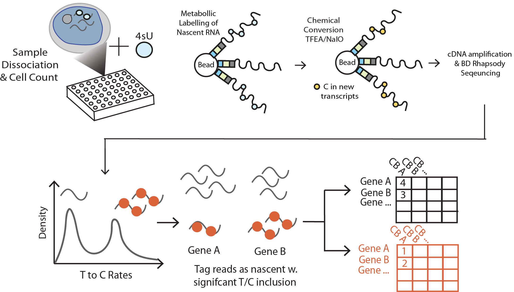

.. _nextflow_workflow_details:

Nextflow Workflow Details
=========================

The scBaNdicooT Nextflow pipeline orchestrates all steps required to process nascent single-cell RNA-seq data generated on BD Rhapsody or similar microwell-based platforms, from raw FASTQ files through to gene-by-cell count matrices for nascent, total, and nascent-to-total ratio (NTR) outputs.

Pipeline Overview
-----------------

The pipeline consists of the following steps:

1. **Read QC** (`FastQC <https://www.bioinformatics.babraham.ac.uk/projects/fastqc/>`_) — Quality assessment of raw FASTQ files.
2. **Adapter Trimming** (`Cutadapt <https://cutadapt.readthedocs.io/en/stable/>`_) — Removal of sequencing adapters and low-quality bases.
3. **Trimmed Read QC** (`FastQC <https://www.bioinformatics.babraham.ac.uk/projects/fastqc/>`_) — Quality assessment after trimming.
4. **Alignment** (`STAR <https://github.com/alexdobin/STAR>`_) — Alignment to a reference genome using STAR, with parameters optimised for BD Rhapsody barcode geometry.
5. **Sort and Index** (`SAMtools <http://www.htslib.org/>`_) — Sorting and indexing of aligned BAM files.
6. **Model Fitting** (scBaNdicooT) — Beta-mixture model fitting to classify T-to-C conversions as nascent or background.
7. **Count Matrix Generation** (scBaNdicooT) — Generation of separate gene-by-cell matrices for nascent, total, and NTR data.
8. **Summary Reports** (scBaNdicooT) — HTML summary reports per sample.

Workflow Configuration
----------------------

The pipeline is configured via a ``nextflow.config`` file and accepts command-line parameters. Key parameters include:

.. list-table::
   :widths: 25 15 60
   :header-rows: 1

   * - Parameter
     - Default
     - Description
   * - ``--samplesheet``
     - *required*
     - Path to CSV samplesheet (see below).
   * - ``--genome``
     - *required*
     - Path to STAR genome index directory.
   * - ``--gtf``
     - *required*
     - Path to genome annotation GTF file.
   * - ``--outdir``
     - ``./results``
     - Directory for pipeline output.
   * - ``--min_conversion_rate``
     - ``0.1``
     - Minimum T-to-C conversion rate threshold for nascent classification.
   * - ``--em_iterations``
     - ``100``
     - Maximum number of EM algorithm iterations.
   * - ``-profile``
     - ``standard``
     - Nextflow execution profile (``standard``, ``conda``, ``docker``, ``singularity``).

Samplesheet Format
------------------

Prepare a CSV samplesheet with the following columns:

.. code-block:: text

   sample,fastq_1,fastq_2
   sample1,/path/to/sample1_R1.fastq.gz,/path/to/sample1_R2.fastq.gz
   sample2,/path/to/sample2_R1.fastq.gz,/path/to/sample2_R2.fastq.gz

Each row represents one sample. ``fastq_1`` and ``fastq_2`` correspond to paired-end reads. For BD Rhapsody data, ``fastq_2`` contains the cDNA read.

Running the Pipeline
--------------------

.. code-block:: bash

   nextflow run theheking/scBaNdicooT \
       --samplesheet samplesheet.csv \
       --genome /path/to/star_index \
       --gtf /path/to/annotation.gtf \
       --outdir results/ \
       -profile docker

To resume an interrupted run, add the ``-resume`` flag:

.. code-block:: bash

   nextflow run theheking/scBaNdicooT \
       --samplesheet samplesheet.csv \
       --genome /path/to/star_index \
       --gtf /path/to/annotation.gtf \
       --outdir results/ \
       -profile docker \
       -resume

Pipeline Output
---------------

The pipeline produces the following key output files under ``--outdir``:

.. code-block:: text

   results/
   ├── fastqc/               # Raw and trimmed FastQC HTML reports
   ├── multiqc/              # Aggregated MultiQC summary
   ├── star/                 # Aligned BAM files (sorted and indexed)
   ├── scbandicoot/
   │   ├── nascent/          # Nascent gene-by-cell count matrices
   │   ├── total/            # Total gene-by-cell count matrices
   │   ├── ntr/              # Nascent-to-total ratio matrices
   │   └── reports/          # Per-sample HTML summary reports
   └── pipeline_info/        # Nextflow execution reports and logs

Citations
---------

If you use this pipeline in your research, please cite:

* Pending paper

Also cite the key tools used:

* **FastQC**: Andrews, S. (2010). FastQC: A Quality Control Tool for High Throughput Sequence Data.
* **Cutadapt**: Martin, M. (2011). Cutadapt removes adapter sequences from high-throughput sequencing reads. *EMBnet.journal*.
* **STAR**: Dobin, A. *et al.* (2013). STAR: ultrafast universal RNA-seq aligner. *Bioinformatics*.
* **SAMtools**: Li, H. *et al.* (2009). The Sequence Alignment/Map format and SAMtools. *Bioinformatics*.
